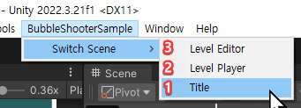
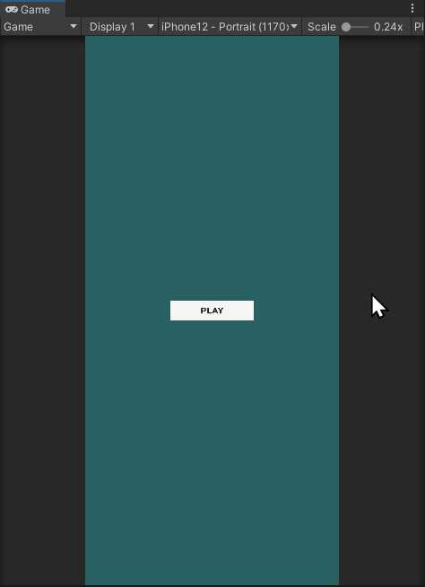
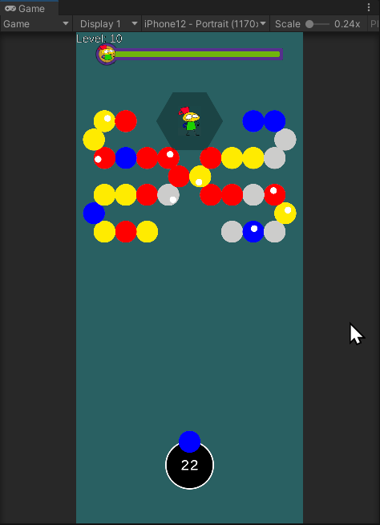
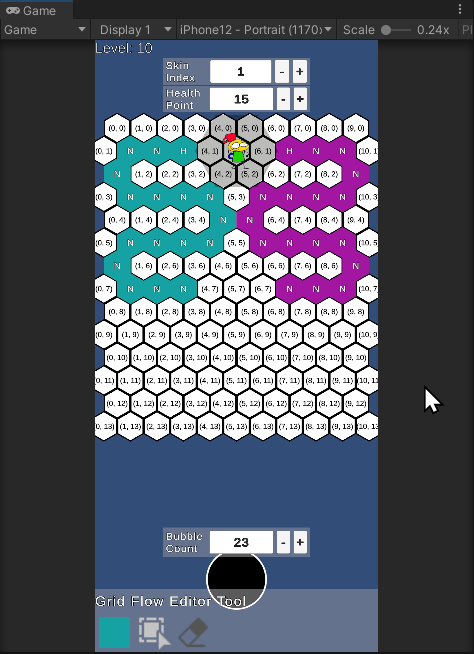
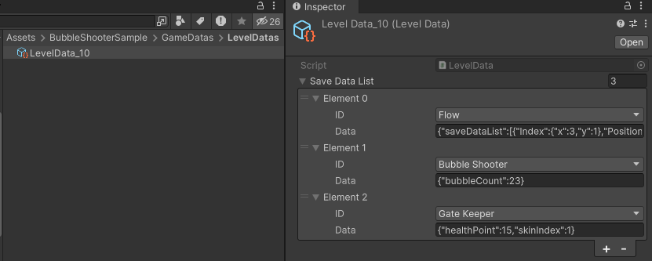

# Bubble Shooter Sample
버블 위치 사가 3 스테이지 10 을 모작한 샘플 프로젝트 입니다.

## 사용한 Unity 에디터 버전
Unity 에디터 버전 2022.3.21f1 을 사용했습니다.

## Unity 데이터에서 플레이 가능한 씬
프로젝트를 열면, Unity 에디터 상단 메뉴에 플레이 가능한 씬을 여는 메뉴를 준비해 두었습니다. 각 씬별 특징을 간략히 설명하겠습니다.  

1. Title 씬 - 화면 중앙에 Play 버튼이 있습니다. LevelPlayer 씬으로 이동하는 기능만을 제공합니다.  

2. LevelPlayer 씬 - 버블 쏘기 -> 매치된 버블 제거 -> 연결이 끊어진 버블 떨어뜨리기 -> 다시 버블이 채워넣기 순서의 게임 루프를 수행합니다. 매치된 버블에 공격 포인트가 포함되어 있다면 상단 중앙의 게이트 키퍼를 공격합니다.  

3. LevelEditor 씬 - 레벨 에디터를 통해 설정한 값들은 LevelData_10.asset (ScriptableObject) 파일에 기록하고 있습니다. LevelEditor 씬에서 아래의 설정들을 파일에 기록한 후, LevelPlayer 씬에서 파일에 기록된 데이터를 로드하고 있습니다.  
  - 버블이 생성되는 경로를 지정하는 데이터
  - 쏠 수 있는 버블의 개수를 지정하는 데이터
  - 게이트 키퍼의 HP 와 스킨 인덱스를 지정하는 데이터  
  
  
